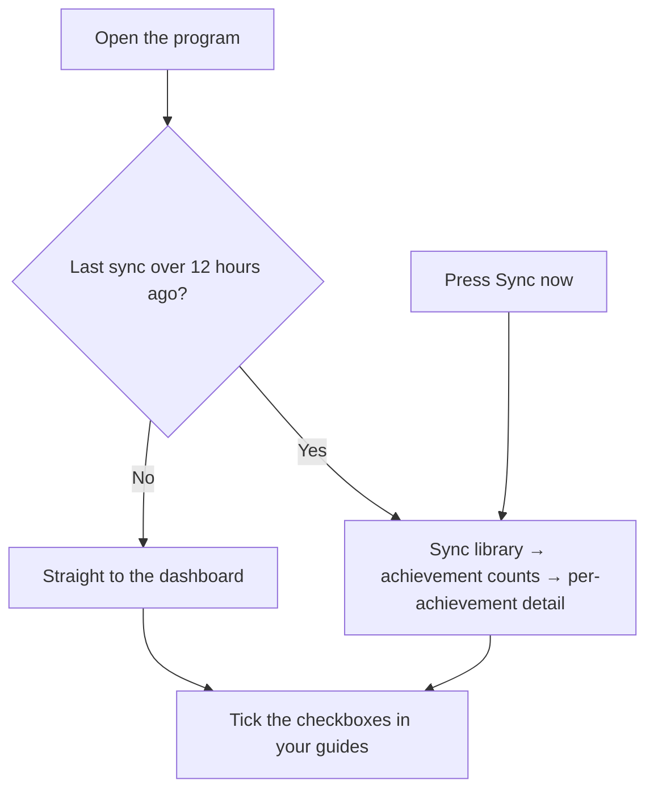
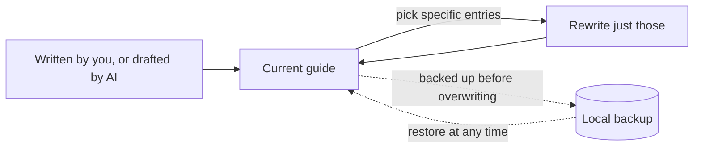

# 🎮 Steam Achievement Tracker & AI Guide

**English** · [中文](README.zh.md)

> Tracks how far you have got in every game in your Steam library, and keeps the guides you write for them in step. It all runs on your own machine — your data stays there, with optional Notion sync and AI-drafted guides.

---

## 🌟 What it does

### 1. Tracks your library

The dashboard lists your games and how complete each one is, floating anything you have played in the last five days to the top. **Sync now** pulls fresh data from Steam whenever you want it.

### 2. Ticks your guide checkboxes for you

If you keep achievement guides as checklists — a Notion page or a local Markdown file — the program ticks off the ones you have actually unlocked on Steam.

* **Notion**: set it up on the settings page (the gear at the top right of the dashboard). It creates the guide database for you, so there is no database ID to copy across by hand.
* **Local Markdown**: read directly, with nothing to configure.

### 3. Drafts guides with AI

Optional. The AI searches the web and drafts an achievement guide, and what it writes is checked against your real achievement data before it lands.

* Works with **DeepSeek** and **Anthropic**. You hold your own API key.
* Every run tells you how many tokens it spent.
* **What the program guarantees**: the shape and the data — one checkbox per achievement, names matching Steam exactly, descriptions quoted as they are, unlock states true to your account.
* **What it cannot**: whether the advice is any good. It checks format and data, never content. Read the guide through yourself.

### 4. Rewrites in place, and backs out safely

* **Only what you picked**: ask the AI to revise a few entries and only those are rewritten. Every other byte survives untouched, including paragraphs you edited by hand.
* **Backed up twice**: the original is kept behind the backup button at the end of the game's row before anything is overwritten, and again when the new version is written back. You can always change your mind.

### 5. English and Chinese

Two buttons at the top of the settings page switch the interface language, and the change takes effect immediately.

* **Game and achievement names are stored in both**: switching language only changes what is displayed, so there is nothing to re-sync, and the search box matches either name.
* **A newly written guide follows the interface language**: to turn a Chinese guide into an English one, switch the language and press **Rewrite**. When a guide's language does not match the interface, the achievement panel says so.

---

## ⏱️ When it syncs

Nothing schedules itself in the background. Every sync happens because you **opened the program** or **pressed Sync now**.

| Trigger | When | What it does |
| :--- | :--- | :--- |
| **Opening the program** | Every cold start | Checks when the last sync finished. Longer ago than 12 hours, it pulls **library + achievement counts + per-achievement detail** and ticks your checkboxes; less than that, it goes straight to the dashboard. |
| **Sync now** | Every time you press it | Ignores the clock entirely. Re-pulls **library + achievement counts + per-achievement detail** and refreshes the checkboxes in every guide. |

> **Worth knowing**: that staleness check runs once, at the moment of starting. Leave the program open and the data will not keep itself fresh in the background — press **Sync now** or restart it when you want it current.

---

## 🚀 Getting started

### 1. What you need

* **Windows**, with nothing else to install.
* A **Steam Web API Key** ([request one](https://steamcommunity.com/dev/apikey)) and your **SteamID64** ([look it up](https://steamid.io)). The first launch shows a setup form and will not open the dashboard until it is filled in.

### 2. Install and run

Download the packaged archive from the [Releases page](https://github.com/LethalKebab/steam-achievement-tracker/releases) — around 138 MB:

1. Unzip it into a folder you mean to keep. The database is created inside that folder, so moving or deleting it moves or deletes your data.
2. Run the main `exe`. The build is unsigned, so the first launch brings up "Windows protected your PC" — click **More info → Run anyway**.

### 3. Updating

* From `v1.1.4` onward the program checks for updates on its own.
* You can also download the latest archive at any time and unzip it over the old folder. **Quit from the tray first** — Windows will not replace a program while it is running.
* **Neither route touches your local database or your own settings.**

---

## 📚 More documentation

* **[Connecting Notion](docs/notion-setup.md)**: step by step through the guide database, including the authorisation step that is missed most often.
* **[Guide sync](docs/guides.md)**: how checkboxes are matched, and how AI generation works in detail.
* **[Data and backups](docs/data.md)**: what the database holds, backing up and restoring, moving to another machine, CSV export.
* **[Configuration](docs/configuration.md)**: every setting, including changing the port.
* **[Command line](docs/cli.md)**: running from source, and the full command reference.

---

## 🤝 Contributing

Issues and pull requests are welcome. If you have ideas about how the interface behaves, the AI prompts, or the sync logic, do get in touch.

Before changing any code, read the **[contributing guide](CONTRIBUTING.md)**: how to run it from source, which constraints must not be touched, and how tests and pull requests work here.

---

## 📄 Licence

Released under the [MIT License](LICENSE).
