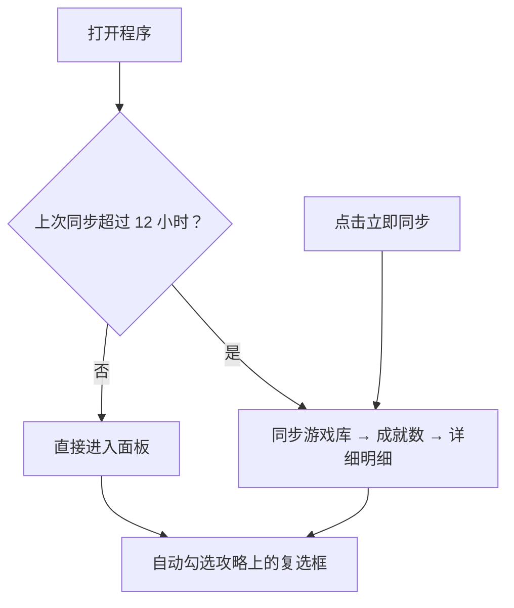
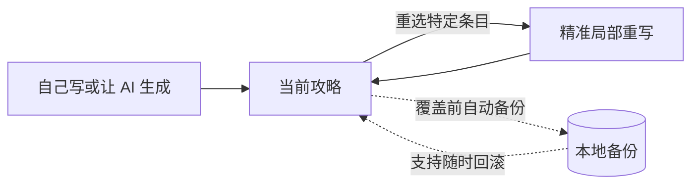

# 🎮 Steam Achievement Tracker & AI Guide

[English](README.md) · **中文**

> 追踪 Steam 库里每个游戏的成就进度，顺带管理你为它们写的攻略。全程在本地运行，兼顾隐私、Notion 联动与 AI 智能指南生成。

---

## 🌟 核心功能

### 1. 追踪你的库

面板会清晰列出你的游戏和完成度，最近 5 天玩过的游戏会自动置顶。点击「立即同步」即可按需从 Steam 拉取最新数据。

### 2. 自动同步攻略复选框

如果你习惯将成就攻略写成清单（无论是 Notion 页面还是本地 Markdown 文件），程序都能自动把你在 Steam 上已经解锁的成就勾选上。

* **Notion 联动**：在设置页配置（面板右上角齿轮），攻略数据库由程序替你自动创建，无需手抄繁琐的数据库 ID。
* **本地 Markdown**：直接读取，无需任何额外配置。

### 3. AI 智能生成攻略

可选功能。让 AI 上网检索并起草一份成就攻略，落地前会严格拿你真实的成就数据进行核对。

* 支持 **DeepSeek** 和 **Anthropic**，API Key 由你自己保管。
* 每跑完一次会明确告诉你本次消耗了多少 Token。
* **程序负责**：保证格式和数据准确（一个成就一个复选框、名字和 Steam 一字不差、描述原样引用、解锁状态与实际一致）。
* **内容把关**：程序核不了内容对错，只核格式和数据。攻略正文请自己通读一遍。

### 4. 局部重写与安全回滚

* **精准重写**：当你让 AI 调整攻略时，只会重写你选中的那几条，其余每一个字节原样保留，包括你自己手动修改过的段落。
* **双重备份**：每次覆盖前，原文都会自动保存在游戏行尾的备份按钮后。写回时也会自动留底，支持随时「反悔」。

### 5. 中英文界面

设置页顶部两个按钮切换界面语言，改完即时生效。

* **游戏名和成就名两种语言都存着**：切语言只是换一种显示，不用重新同步，搜索框两种名字都认。
* **新生成的攻略跟着界面语言走**：想把一份中文攻略换成英文，切好语言再点「重写」。攻略语言和界面对不上时，成就面板上会标一句。

---

## ⏱️ 同步机制说明

程序没有后台常驻调度器，所有操作均由**「打开程序」**或**「点击立即同步」**主动触发。

| 触发方式 | 触发时机 | 执行的操作 |
| :--- | :--- | :--- |
| **打开程序** | 每次冷启动 | 检查上次同步时间。若超过 12 小时，自动拉取**游戏库 + 成就数 + 详细明细**并勾选复选框；若未超过 12 小时，直接进入面板。 |
| **立即同步** | 每次手动点击 | 不看时间，强制重新拉取**游戏库 + 成就数 + 详细明细**，并刷新所有攻略页的复选框状态。 |

> **提示**：过期判断只在启动那一刻做一次。如果程序一直开着不关，数据不会在后台自动保持新鲜，需要时请点击「立即同步」或重启程序。

---

## 🚀 快速上手

### 1. 系统要求

* **Windows** 系统，无需额外安装繁琐依赖。
* 需要准备一个 **Steam Web API Key**（[申请地址](https://steamcommunity.com/dev/apikey)）及你的 **SteamID64**（[查询地址](https://steamid.io)）。首次打开程序会先显示一个配置表单，填好后才会进入主面板。

### 2. 安装与运行

直接前往 [Releases 页面](https://github.com/LethalKebab/steam-achievement-tracker/releases) 下载打包好的压缩包（体积约为 138 MB）：

1. 解压到你喜欢的一个固定文件夹。数据库就建在这个文件夹里，移动或删除它等同于移动或删除你的数据。
2. 运行主程序 `exe` 即可开始使用。安装包没有签名，首次启动会弹「Windows 已保护你的电脑」，点**更多信息 → 仍要运行**。

### 3. 如何更新

* 从 `v1.1.4` 版本起，程序支持自动检查更新。
* 你也可以随时手动下载最新压缩包，直接覆盖到原文件夹。手动覆盖前请先**从托盘退出程序**，Windows 不会替换一个正在运行的程序。
* **这两种方式都不会影响或覆盖你的本地数据库与个人配置。**

---

## 📚 更多文档

* **[Notion 配置图解](docs/notion-setup.md)**：分步连接攻略数据库，含最容易漏的那一步授权（英文，按钮名中英对照）。
* **[攻略同步说明](docs/guides.md)**：复选框匹配规则与 AI 生成细节（英文）。
* **[数据与备份](docs/data.md)**：数据库里有什么、备份还原、换一台机器、CSV 导出（英文）。
* **[配置项说明](docs/configuration.md)**：每一项设置，包括改端口（英文）。
* **[命令行用法](docs/cli.md)**：从源码运行与完整命令参考（英文）。

---

## 🤝 参与贡献

欢迎提交 Issue 或 Pull Request！如果你对项目的 UI 交互、AI 提示词或同步逻辑有好的想法，随时欢迎交流。

动手改代码之前，请先看 **[贡献指南](CONTRIBUTING.md)**：怎么从源码跑起来、哪几条约束不能碰、测试和 PR 怎么走（英文）。

---

## 📄 开源协议

本项目基于 [MIT License](LICENSE) 开源。
